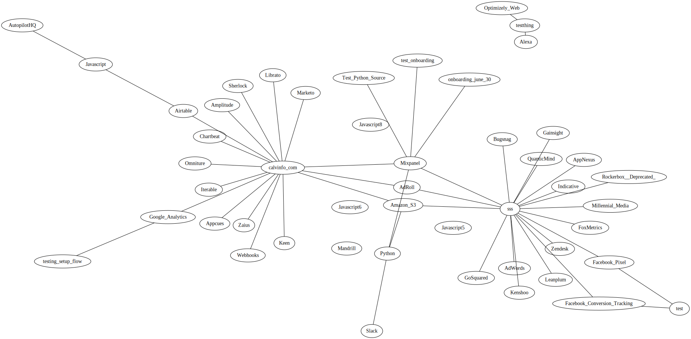

# workspace-graph-generator

This tool is a simple test of Segment's new Platform API. It uses a Python
client to generate ultra-cool graphs of various Segment workspaces:



## Quickstart

To start, you'll need a segment account, and a workspace you have access to.

You'll also want to install Python and `dot(1)`. If you're on Linux, you probably already
have this, if you're on a Mac, run:

```shell
$ brew install dot python3
```

If you haven't already, you will want to install the `requests` module for Python.

```shell
$ pip3 install requests
```

Then run the following from your terminal:

```
$ USER=<email> PASS=<your-password> WORKSPACE=<your-workspace> make run
```

This will generate all the necessary access tokens, query your workspace, and
produce a shiny graphic as `graph.svg`. :sparkles:

On a Mac you can view it in Chrome:

```shell
$ open -a "Google Chrome" graph.svg
```